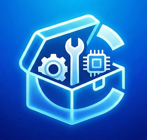

<div align="center">
  <br />
  
  <br />
  <br />

  <h1>CapKit Monorepo</h1>

  <p>
    <strong>Enterprise-grade Capacitor plugins built for performance, security, and architectural consistency.</strong>
  </p>

  <p>
    <a href="https://github.com/cap-kit/capacitor-plugins/actions"></a>
    <a href="https://pnpm.io/"></a>
    <a href="https://github.com/changesets/changesets"></a>
    <a href="./LICENSE"></a>
    <a href="https://github.com/cap-kit/capacitor-plugins/commits/main"></a>
    <a href="https://turbo.build/"></a>
    <a href="https://github.com/renovatebot/renovate"></a>
  </p>

  <h4>
    <a href="#-plugins-collection">Plugins</a> •
    <a href="#-key-features">Key Features</a> •
    <a href="#-architecture">Architecture</a> •
    <a href="#-getting-started">Getting Started</a>
  </h4>
</div>

---

## ✨ Key Features

- ⚡ **Capacitor 8+ Optimized**: Built specifically for the latest Capacitor ecosystem.
- 🏗️ **Native Parity**: True cross-platform support (iOS/Swift, Android/Kotlin, Web/TS).
- 🔒 **Security First**: Specialized in runtime integrity, SSL pinning, and secure environments.
- 🚀 **Turbo Toolchain**: Ultra-fast developer experience with pnpm 10 and Turborepo.
- 🤖 **Automated Releases**: Fully managed via Changesets and GitHub Actions.

---

## 📦 Plugins Collection

The **CapKit** suite ensures a seamless experience across platforms. Each package maintains its own documentation and setup guide.

---

## 🏗️ Architecture & Standards

This repository is a **strict pnpm monorepo**. We enforce high standards to ensure that every plugin is production-ready.

| Component             | Technology                      |
| :-------------------- | :------------------------------ |
| **Package Manager**   | `pnpm` 10+                      |
| **Orchestrator**      | `Turborepo` 2.x                 |
| **Minimum Capacitor** | `v8.0.0`                        |
| **Versioning**        | `Changesets`                    |
| **CI/CD**             | `GitHub Actions` (macOS-latest) |

---

<!-- PLUGINS_TABLE_START -->

 **Information:** All plugins are optimized for **Capacitor v8+** and tested for native parity.

<p align="center">
  📦 <strong>Total Plugins:</strong> 4 &nbsp;&bull;&nbsp; 📈 <strong>Weekly Downloads:</strong> 
</p>
<br />
<table width="100%">
<tr>

<td align="center" width="33%" valign="top" height="280">
  <br />
  <h3><a href="./packages/integrity">🛡️ Integrity</a></h3>
  <p><a href="https://www.npmjs.com/package/@cap-kit/integrity"><code>@cap-kit/integrity</code></a></p>
  <p>
    <a href="https://www.npmjs.com/package/@cap-kit/integrity"></a>
    <a href="https://www.npmjs.com/package/@cap-kit/integrity"></a>
  </p>
  <div style="height: 60px; overflow: hidden;">
    <p><font size="2">Runtime integrity and environment signal detection for Capacitor v8 applications.</font></p>
  </div>
  <hr size="1" color="#eeeeee" />
  <p>
    <a href="./packages/integrity"><strong>Docs</strong></a> • 
    <a href="https://www.npmjs.com/package/@cap-kit/integrity"><strong>NPM</strong></a>
  </p>
</td>

<td align="center" width="33%" valign="top" height="280">
  <br />
  <h3><a href="./packages/rank">⭐ Rank</a></h3>
  <p><a href="https://www.npmjs.com/package/@cap-kit/rank"><code>@cap-kit/rank</code></a></p>
  <p>
    <a href="https://www.npmjs.com/package/@cap-kit/rank"></a>
    <a href="https://www.npmjs.com/package/@cap-kit/rank"></a>
  </p>
  <div style="height: 60px; overflow: hidden;">
    <p><font size="2">Unified Capacitor v8 plugin for native In-App Reviews and cross-platform Store navigation.</font></p>
  </div>
  <hr size="1" color="#eeeeee" />
  <p>
    <a href="./packages/rank"><strong>Docs</strong></a> • 
    <a href="https://www.npmjs.com/package/@cap-kit/rank"><strong>NPM</strong></a>
  </p>
</td>

<td align="center" width="33%" valign="top" height="280">
  <br />
  <h3><a href="./packages/settings">⚙️ Settings</a></h3>
  <p><a href="https://www.npmjs.com/package/@cap-kit/settings"><code>@cap-kit/settings</code></a></p>
  <p>
    <a href="https://www.npmjs.com/package/@cap-kit/settings"></a>
    <a href="https://www.npmjs.com/package/@cap-kit/settings"></a>
  </p>
  <div style="height: 60px; overflow: hidden;">
    <p><font size="2">Capacitor plugin to open app and system settings on iOS and Android.</font></p>
  </div>
  <hr size="1" color="#eeeeee" />
  <p>
    <a href="./packages/settings"><strong>Docs</strong></a> • 
    <a href="https://www.npmjs.com/package/@cap-kit/settings"><strong>NPM</strong></a>
  </p>
</td>
</tr>
<tr>

<td align="center" width="33%" valign="top" height="280">
  <br />
  <h3><a href="./packages/ssl-pinning">🔒 Ssl Pinning</a></h3>
  <p><a href="https://www.npmjs.com/package/@cap-kit/ssl-pinning"><code>@cap-kit/ssl-pinning</code></a></p>
  <p>
    <a href="https://www.npmjs.com/package/@cap-kit/ssl-pinning"></a>
    <a href="https://www.npmjs.com/package/@cap-kit/ssl-pinning"></a>
  </p>
  <div style="height: 60px; overflow: hidden;">
    <p><font size="2">Capacitor plugin for runtime SSL certificate fingerprint pinning on iOS and Android</font></p>
  </div>
  <hr size="1" color="#eeeeee" />
  <p>
    <a href="./packages/ssl-pinning"><strong>Docs</strong></a> • 
    <a href="https://www.npmjs.com/package/@cap-kit/ssl-pinning"><strong>NPM</strong></a>
  </p>
</td>
<td width="33%"></td>
<td width="33%"></td>
</tr>
</table>
<!-- PLUGINS_TABLE_END -->

## 🚀 Getting Started

### Prerequisites

- **Node.js**: v24+
- **pnpm**: v10+

### Usage

To add a plugin to your project:

```bash
pnpm add @cap-kit/test-plugin
npx cap sync
```

## 🤝 Contributing

Contributions are welcome! Please follow our [CONTRIBUTING.md](./CONTRIBUTING.md) guidelines:

- Format: `type(scope): Subject` (es. `feat(integrity): Add root detection`)
- Titles and descriptions must be in **English**.

## 📄 License

CapKit is [MIT licensed](./LICENSE).
