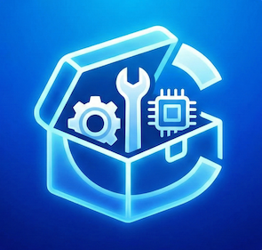

<div align="center">
  

# CapKit Monorepo

**Enterprise-grade Capacitor 8 plugins focused on performance, security and architectural determinism.**

  <br/>

<a href="https://github.com/cap-kit/capacitor-plugins/actions"></a>
<a href="https://pnpm.io/"></a>
<a href="https://github.com/changesets/changesets"></a>
<a href="./LICENSE"></a>
<a href="https://github.com/cap-kit/capacitor-plugins/commits/main"></a>
<a href="https://turbo.build/"></a>
<a href="https://github.com/renovatebot/renovate"></a>

  <br/>

[Plugins](#-plugins-collection) •
[Demo App](#-demo-app) •
[Architecture](#-architecture--standards) •
[Getting Started](#-getting-started) •
[Contributing](#-contributing)
</div>

---

## ✨ Why CapKit

|                                    |                                                        |
| ---------------------------------- | ------------------------------------------------------ |
| ⚡ **Capacitor 8 Native-First**    | Built specifically for the latest Capacitor runtime    |
| 🏗 **Strict Monorepo Architecture** | Deterministic pnpm workspace + Turborepo orchestration |
| 🔒 **Security-Oriented**           | Integrity signals, SSL pinning, runtime hardening      |
| 🚀 **Automated Releases**          | Changesets + CI-driven publishing                      |
| 🤖 **Dependency Safety**           | Renovate with controlled production updates            |

---

## 📦 Plugins Collection

Each plugin is fully cross-platform:

- Web (TypeScript)
- iOS (Swift)
- Android (Kotlin)

Every plugin also ships a **runnable demo app** — see [Demo App](#-demo-app).

---

## 🧪 Demo App

Every plugin includes a **ready-to-run demo app** built from a shared **Angular + Ionic + Capacitor 8** template.

| Component       | Path                             | Description                                          |
| --------------- | -------------------------------- | ---------------------------------------------------- |
| Shared template | [`demo/`](./demo)                | Reference app used as the base for every plugin demo |
| Per-plugin app  | `packages/<plugin>/example-app/` | Generated demo wiring the local plugin via `file:..` |

The per-plugin `example-app/` is **generated**, never edited by hand. [`scripts/prepare-demo.ts`](./scripts/prepare-demo.ts) copies the shared `demo/` app, applies plugin-specific patches (Capacitor config, routes, native bootstrapping) and copies static pages from each plugin's `example-app/static/`.

### Regenerate a demo

```bash
pnpm install
tsx scripts/prepare-demo.ts <plugin-name>
```

### Run a demo

```bash
# From packages/<plugin>/example-app/
pnpm install
pnpm run build:ios      # build web + cap sync ios + open Xcode
pnpm run build:android  # build web + cap sync android + open Android Studio
```

---

<!-- PLUGINS_TABLE_START -->

> **Information:** All plugins are optimized for **Capacitor v8+** and tested for native parity.

<p align="center">
  📦 <strong>Total Plugins:</strong> 6 &nbsp;&bull;&nbsp; ⚡ <strong>Core:</strong> 
</p>

<table width="100%">
<tr>

<td align="center" width="33%" valign="top">

### <a href="./packages/integrity">🛡️ Integrity</a>

<a href="https://www.npmjs.com/package/@cap-kit/integrity"><code>@cap-kit/integrity</code></a>

<a href="https://www.npmjs.com/package/@cap-kit/integrity"></a>
<a href="https://www.npmjs.com/package/@cap-kit/integrity"></a>

Runtime integrity and environment signal detection for Capacitor v8 applications.

<a href="./packages/integrity"><strong>Docs</strong></a> • 
<a href="https://www.npmjs.com/package/@cap-kit/integrity"><strong>NPM</strong></a>

</td>

<td align="center" width="33%" valign="top">

### <a href="./packages/people">👥 People</a>

<a href="https://www.npmjs.com/package/@cap-kit/people"><code>@cap-kit/people</code></a>

<a href="https://www.npmjs.com/package/@cap-kit/people"></a>
<a href="https://www.npmjs.com/package/@cap-kit/people"></a>

Unified, high-performance contact management for Capacitor with zero-permission picking and capability-based access.

<a href="./packages/people"><strong>Docs</strong></a> • 
<a href="https://www.npmjs.com/package/@cap-kit/people"><strong>NPM</strong></a>

</td>

<td align="center" width="33%" valign="top">

### <a href="./packages/rank">⭐ Rank</a>

<a href="https://www.npmjs.com/package/@cap-kit/rank"><code>@cap-kit/rank</code></a>

<a href="https://www.npmjs.com/package/@cap-kit/rank"></a>
<a href="https://www.npmjs.com/package/@cap-kit/rank"></a>

Unified Capacitor v8 plugin for native In-App Reviews and cross-platform Store navigation.

<a href="./packages/rank"><strong>Docs</strong></a> • 
<a href="https://www.npmjs.com/package/@cap-kit/rank"><strong>NPM</strong></a>

</td>
</tr>
<tr>

<td align="center" width="33%" valign="top">

### <a href="./packages/redsys">💳 Redsys</a>

<a href="https://www.npmjs.com/package/@cap-kit/redsys"><code>@cap-kit/redsys</code></a>

<a href="https://www.npmjs.com/package/@cap-kit/redsys"></a>
<a href="https://www.npmjs.com/package/@cap-kit/redsys"></a>

Redsys InApp SDK bridge for Capacitor v8. Supports native Direct Payment and secure 3D Secure (3DS) WebView flows with unified cross-platform API and HMAC signature utilities.

<a href="./packages/redsys"><strong>Docs</strong></a> • 
<a href="https://www.npmjs.com/package/@cap-kit/redsys"><strong>NPM</strong></a>

</td>

<td align="center" width="33%" valign="top">

### <a href="./packages/settings">⚙️ Settings</a>

<a href="https://www.npmjs.com/package/@cap-kit/settings"><code>@cap-kit/settings</code></a>

<a href="https://www.npmjs.com/package/@cap-kit/settings"></a>
<a href="https://www.npmjs.com/package/@cap-kit/settings"></a>

Capacitor plugin to open app and system settings on iOS and Android.

<a href="./packages/settings"><strong>Docs</strong></a> • 
<a href="https://www.npmjs.com/package/@cap-kit/settings"><strong>NPM</strong></a>

</td>

<td align="center" width="33%" valign="top">

### <a href="./packages/tls-fingerprint">🔒 Tls Fingerprint</a>

<a href="https://www.npmjs.com/package/@cap-kit/tls-fingerprint"><code>@cap-kit/tls-fingerprint</code></a>

<a href="https://www.npmjs.com/package/@cap-kit/tls-fingerprint"></a>
<a href="https://www.npmjs.com/package/@cap-kit/tls-fingerprint"></a>

Runtime TLS leaf certificate SHA-256 fingerprint validation plugin for Capacitor (iOS & Android)

<a href="./packages/tls-fingerprint"><strong>Docs</strong></a> • 
<a href="https://www.npmjs.com/package/@cap-kit/tls-fingerprint"><strong>NPM</strong></a>

</td>
</tr>
</table>

<details>
<summary><strong>📱 Compact View (Mobile Friendly)</strong></summary>


### 🛡️ Integrity

`@cap-kit/integrity`

 

Runtime integrity and environment signal detection for Capacitor v8 applications.

[Docs](./packages/integrity) • [NPM](https://www.npmjs.com/package/@cap-kit/integrity)

---

### 👥 People

`@cap-kit/people`

 

Unified, high-performance contact management for Capacitor with zero-permission picking and capability-based access.

[Docs](./packages/people) • [NPM](https://www.npmjs.com/package/@cap-kit/people)

---

### ⭐ Rank

`@cap-kit/rank`

 

Unified Capacitor v8 plugin for native In-App Reviews and cross-platform Store navigation.

[Docs](./packages/rank) • [NPM](https://www.npmjs.com/package/@cap-kit/rank)

---

### 💳 Redsys

`@cap-kit/redsys`

 

Redsys InApp SDK bridge for Capacitor v8. Supports native Direct Payment and secure 3D Secure (3DS) WebView flows with unified cross-platform API and HMAC signature utilities.

[Docs](./packages/redsys) • [NPM](https://www.npmjs.com/package/@cap-kit/redsys)

---

### ⚙️ Settings

`@cap-kit/settings`

 

Capacitor plugin to open app and system settings on iOS and Android.

[Docs](./packages/settings) • [NPM](https://www.npmjs.com/package/@cap-kit/settings)

---

### 🔒 Tls Fingerprint

`@cap-kit/tls-fingerprint`

 

Runtime TLS leaf certificate SHA-256 fingerprint validation plugin for Capacitor (iOS & Android)

[Docs](./packages/tls-fingerprint) • [NPM](https://www.npmjs.com/package/@cap-kit/tls-fingerprint)

---

</details>

<!-- PLUGINS_TABLE_END -->

---

## 🧱 Architecture & Standards

This repository follows a **strict pnpm monorepo model**.

| Layer              | Stack                               |
| ------------------ | ----------------------------------- |
| Package Manager    | `pnpm 11+`                          |
| Task Orchestration | `Turborepo 2.x`                     |
| CI/CD              | GitHub Actions (`macos-latest`)     |
| Versioning         | Changesets                          |
| Minimum Capacitor  | `v8.0.0`                            |
| Demo Workspace     | `demo/` + `packages/*/example-app/` |

### Architectural Guarantees

- No isolated packages
- Centralized TypeScript configuration
- Deterministic CI (path-aware execution)
- Native parity enforced (Web / iOS / Android)
- No manual publishing
- Every plugin ships a runnable `example-app/` generated from the shared `demo/` template

---

## 🚀 Getting Started

### Requirements

- Node.js ≥ 24
- pnpm ≥ 11

### Install a plugin

```bash
pnpm add @cap-kit/<plugin-name>
npx cap sync
```

### Try a plugin demo

Each plugin ships a runnable demo app wired to the local source:

```bash
# 1. Build the plugin (run from its package directory)
cd packages/<plugin-name> && pnpm run build

# 2. Regenerate the demo app from the shared template
tsx scripts/prepare-demo.ts <plugin-name>

# 3. Run the generated app
cd packages/<plugin-name>/example-app
pnpm install
pnpm run build:ios   # or build:android
```

---

## 🤝 Contributing

Please follow Conventional Commits:

```
type(scope): Subject
```

Example:

```
feat(integrity): Add emulator detection
```

Rules:

- Scope is mandatory
- Subject must be Sentence-case
- Pull Requests must be written in English

See [CONTRIBUTING.md](./CONTRIBUTING.md).

---

## 📄 License

MIT — see [LICENSE](./LICENSE).
